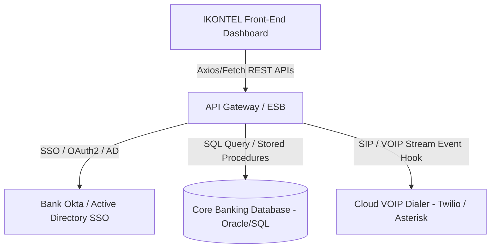

# IKONTEL Unified Lending Lifecycle & Debt Recovery Command
## Comprehensive Product Manual & Sales Team Presentation Playbook

Welcome to the **IKONTEL Omnichannel Engagement Platform** Master Playbook. This guide is specifically compiled for the **Sales and Operations Teams** to serve as a comprehensive user manual and high-impact live demonstration reference. 

Use this document to understand what we built, detail every feature and dashboard element, explain what each KPI card and chart represents, and provide a step-by-step user manual on how to operate the system live to WOW prospective banking and NBFC clients.

---

## 📋 Section 1: Executive Overview (What We Built Here)

We have built a state-of-the-art **High-Fidelity Unified Lending Lifecycle & Debt Recovery Command Center**. Designed for enterprise-level financial institutions, digital lenders, and collections agencies, this single-page dashboard simulates a complete 360° view of loan customer management from the initial lead stage to digital KYC, loan calculator disbursement, automated omnichannel collections, legal notices, and real-time AI supervisor monitoring.

### Core Technical Pillars & Architecture:
* **The Stack**: Built on modern, ultra-responsive HTML5 and Vanilla ES6+ JavaScript modules. No bulky third-party framework overhead, making it fast, robust, and highly portable.
* **Unified State Management**: Orchestrated by a single central reactive state engine (`mockStore.js`) that synchronizes every action immediately. When a payment is logged inside the simulated mobile field app, the global executive counters update dynamically.
* **Modern Aesthetic Styling**: Tailored using Tailwind CSS v3 with a sleek dark-mode glassmorphic interface, glowing teal accents, high-contrast typography, and smooth CSS transitions.
* **Advanced Visualizations**: Backed by high-speed interactive **ApexCharts** for real-time analytics mapping and data filtering.
* **Live Emulators**: Integrated with a floating **AI Communication Lab** (simulating interactive AI Voice Bots and WhatsApp messaging) and a framed **Field Agent Mobile App Simulator** to showcase field-to-office synchronicity.

---

## 🛡️ Section 2: 13-Module Suite & Role-Based Security Map

The platform organizes lending and collections into **13 complete modules**. To safeguard enterprise data, access is strictly governed by **Role-Based Access Control (RBAC)**. 

Below is the complete functional directory of what all modules are built and which corporate roles can access them:

| Module Name | Core Functional Features | Who Can Access? | Sales Value Proposition / Client Impact |
| :--- | :--- | :--- | :--- |
| **1. Login & Auth** | Dual-Tab Login (Standard Corporate vs. Instant Demo Role Switcher), simulated Multi-Factor OTP code verification. | **All Roles** | **Enterprise-Grade Security**: Simulates multi-factor auth (MFA) and demonstrates how easily administrators can partition the system. |
| **2. Command Center** | 8 KPI Metric Widgets, Funnel & Radar Charts, Active Voice Bot Dialer Logs, WhatsApp progress meters. | **All Roles** *(Views change per role)* | **Single Pane of Glass**: Gives executives a 360-degree, real-time pulse of collections, bot performance, and pipeline volumes. |
| **3. Campaigns** | Campaign directories, Flow creation wizards, interactive metrics cards. | **Admin, Campaign Manager** | **Hyper-Targeted Outbound**: Launch Voice and WhatsApp blast campaigns target-grouped by borrower risk profiles in 3 clicks. |
| **4. Leads & CRM** | Leads list directory, drag-and-drop Kanban Stage Pipeline board, Lead 360 profile deep-dives. | **Admin, Campaign Mgr, Sales Agent** | **Frictionless CRM**: Streamline customer acquisition from first landing to KYC-ready stages, boosting conversion probabilities. |
| **5. Onboarding** | Digital KYC checklist hub, Aadhaar/PAN/Income scanner, interactive OCR laser scanner beam. | **Admin, Sales Agent** | **Zero Manual Ingestion**: Drop-off rates plunge when borrowers scan IDs and auto-extract validated details in 2 seconds. |
| **6. Loan Management** | Amortization Calculator, Tenure/Principal sliders, dynamic EMI schedules, disbursement controls. | **Admin, Sales Agent, Coll. Manager** | **Instant Credit Decisioning**: Calculate EMIs, adjust interest rates dynamically with clients, and approve loans on the fly. |
| **7. Collections** | Recovery status trackers, communication ledgers, visual **Journey Builder**, Field Mobile Phone App frame. | **Admin, Collection Manager** | **Mitigate NPAs**: Coordinate regional collectors and set automated retries to collect outstanding payments with zero lag. |
| **8. Legal & Warnings** | Active court cases tracker, legal notice generators, compliance logs. | **Admin, Legal Team** | **Regulatory Safeguard**: Auto-generate formal legal notices (like Section 138) to shield the lender during default escalations. |
| **9. CX Hub** | Customer satisfaction logs, NPS, CSAT, CES charts, interactive incoming chat simulators. | **Admin, CX Team** | **Protect Brand Trust**: Monitor sentiment trends and handle borrower disputes automatically using smart bots. |
| **10. AI Analytics** | Sentiment trackers, classification matrices, best contact hours grids. | **Admin, Campaign Mgr, Coll. Mgr, CX** | **Predictive Intelligence**: Map transcripts to identify borrower intent and optimize auto-dialing times to maximize recovery. |
| **11. Reports** | Aggregated transaction tables, multi-column search filters, Excel exports. | **Admin, Campaign/Coll. Mgr, Legal** | **Audit Ready Logs**: Instantly generate clean financial ledgers, filter by region/risk, and export records for auditing. |
| **12. User Mgmt** | Permission matrices, staff directories, VPN node network status lists. | **Admin** | **Strict Security Auditing**: Track internal user roles and verify secure corporate VPN node connectivity. |
| **13. Settings** | System dialer concurrency bounds, official green-tick WhatsApp Template Editor. | **Admin, Campaign Mgr, Coll. Mgr** | **Configurable Scaling**: Customize verified templates and set channels limits to match backend capabilities. |

---

## 📊 Section 3: Executive Dashboard Elements Guide
### What We Use Each Dashboard Element For & What They Present

The **Executive Dashboard** acts as the command center for executives. When showcasing the platform, walk the client through these specific elements:

### A. The 8 Top KPI Widgets (Real-Time Metrics)
1. **Total Pool Leads**: Presenting the total size of the customer ingestion pool (scales at 5,200x of mock state to show enterprise capacity). 
   * *Used for*: Showing marketing and acquisition velocity.
2. **Interested Leads**: Represents leads who have interacted with a bot/agent and expressed positive intent (calculated at 32.8% of the pool). 
   * *Used for*: Reviewing middle-funnel health.
3. **Loan Applications**: Tracks how many leads have actively moved forward and submitted an application.
   * *Used for*: Monitoring conversion rates.
4. **Loans Approved**: The volume of loans that passed credit checks and digital KYC.
   * *Used for*: Measuring credit policy approval performance.
5. **Collections Today**: A live aggregate of all funds recovered today across Voice, WhatsApp, and Field Agents. Updates live when the mobile simulator logs a payment.
   * *Used for*: Real-time cashflow tracking.
6. **Overdue DPD Accounts**: Tracks delinquent accounts that have missed payment timelines, highlighted in high-contrast red warning.
   * *Used for*: Immediate risk tracking.
7. **AI BOT Resolution %**: Displays the First Contact Resolution (FCR) rate achieved by the automated bots without human intervention.
   * *Used for*: Showcasing the cost-saving power of the AI bot.
8. **Revenue Generated**: The total monetary volume processed through the platform (mocked at a scaled ₹48.2 Crores).
   * *Used for*: Presenting high-value corporate scale.

### B. Interactive Charts
* **Lead Acquisition Source Funnel**: A horizontal bar chart mapping how leads convert across five operational stages: *Acquired ➔ Contacted ➔ Interested ➔ Approved ➔ Disbursed*. Helps managers identify where bottlenecks occur.
* **Omnichannel Communications Engagement**: A radar chart tracking borrower response click-through rates (CTR%) across six contact channels: *Voice Bot, WhatsApp, SMS Blast, Direct Email, Agent Dialer, and Field Contact*. Proves that multi-channel reach out-performs traditional dialers.

### C. Live Activity Panels
* **Active Voice Bot Dialer Supervisor**: A live tracking panel displaying outbound bot calls currently running in the background. It displays:
  * Borrower name, DPD status, and a real-time **Sentiment Analysis Tag** (e.g., Stressed, Neutral, Stressed Sentiment, Positive).
  * An glowing red **"Intercept Call"** button that lets supervisors instantly listen in and take over live bot calls in distress.
* **WhatsApp Campaign Flow Status**: Dynamic progress meters showing WhatsApp delivery rate, message read rate, link click-through rate, and undelivered bounds.

---

## 🕹️ Section 4: Operational User Manual
### Step-by-Step Instructions on How to Operate the Live Platform

Use these step-by-step scripts during client demonstrations to showcase the platform's features and ensure a flawless "WOW" factor.

---

### Step 1: Operating the Role-Based Login & MFA
1. **Accessing the Portal**: Open the application at [index.html](file:///c:/Users/Admin/Desktop/Ikontel%20Mian%20Website/ADITYA%20BIRLA/index.html).
2. **Corporate Auth Flow**:
   * Under the **Credential Sign-In** tab, note the pre-filled corporate email (`admin@ikontel.com`).
   * Click **Authenticate Corporate Account**. A high-security **MFA Authorization** modal pops up asking for an OTP.
   * Click **Verify OTP** to complete simulated two-factor verification.
3. **Instant Demo Role Switcher**:
   * Alternatively, select the **Instant Demo Roles** tab.
   * Click **Campaign Manager**. Note that the left-hand sidebar options instantly contract, hiding Collections, Legal, and User Management to safeguard private data.
   * Switch the active role back to **Admin** via the dropdown in the top navbar. The full 13-module suite expands instantly.

---

### Step 2: Operating the AI Communication Lab (Voice & WhatsApp Bot)
This highlights the core AI capability of the IKONTEL dialer and chat system.

#### A. Running the AI Voice Bot Dialer
1. In the top navbar, click the glowing teal button: **"AI Chat & Voice Bot"** to slide open the right-side **AI Communication Lab**.
2. Click the **AI Voice Bot** tab.
3. Use the dropdown to select a borrower (e.g., **Aarav Sharma** or **Priyanka Patel**).
4. Click **Start AI Voice Bot Dialer**.
5. **Watch the live streaming**:
   * The panel displays a live animated wave visualizer.
   * The transcription box streams the dialogue line-by-line in real-time, showing the AI Bot conversational script.
   * The **Intent Detected** and **Sentiment Analysis** meters adapt dynamically based on borrower speech clues.
6. **Agent Handoff**: Click **Agent Handoff** at any time. The system halts the bot and transfers the call to a human supervisor.

#### B. Direct Live Interception (Highly Recommended Demo!)
1. Open the main **Executive Dashboard**.
2. Scroll to the **Active Voice Bot Dialer Supervisor** panel.
3. Find **Amit Deshmukh**, who is flagged with a red **"STRESSED SENTIMENT"** tag due to a medical emergency.
4. Click the glowing **"Intercept Call"** button on his card.
5. **Watch the magic**: The system instantly slides open the AI Communication Lab, switches tabs, selects Amit, and boots the live call transcript. Watch Amit state his medical emergency, and see the bot automatically waive his penalty fee and capture a ₹10,000 promise-to-pay. Once completed, Amit's status automatically syncs to **PTP Set** in the background database!

#### C. Simulating the WhatsApp Interactive Bot
1. Open the **AI Communication Lab** drawer and click the **WhatsApp Bot** tab.
2. At the bottom, click one of the **Quick Response Buttons** (e.g., *Apply Loan*, *Upload KYC*, *EMI Statement*, *Account Portal*, *Digital Service*, *Closure & Top-up*, or *Human Agent*).
3. Watch the simulator instantly post your message and return a tailored AI response detailing online account view procedures, digital self-service statement downloads, upcoming loan closures, or pre-approved top-up offers instantly!

---

### Step 3: Operating Customer Onboarding & AI OCR KYC
1. From the left sidebar, navigate to the **Onboarding** tab.
2. Select a borrower from the KYC pipeline list (e.g., **Priyanka Patel**, marked as *Pending Verification*).
3. **Execute Document Scans**:
   * In the document checklist grid, click **Scan PAN** or **Scan Aadhaar**.
   * Look at the **Interactive AI OCR Scanner** display area: a glowing **neon green laser beam** slides down the panel.
   * The screen shows a loading state as it simulates real-time data parsing.
   * After 2.5 seconds, the scanner displays **AI OCR Extraction Successful** along with the parsed metadata (e.g., identity numbers, biometric checks, document status).
   * Note how the checklist indicator turns into a green checkmark, and Priyanka's global KYC status updates automatically.

---

### Step 4: Operating Collections, Journey Builder & Mobile Field Sync
This showcases how IKONTEL coordinates head-office operations with field agents on the ground.

#### A. Operating the Omnichannel Journey Builder
1. Navigate to the **Collections** tab from the left sidebar.
2. Scroll to the bottom to view the **IKONTEL Journey Builder** canvas.
3. Click **Add Retry Sequence** in the canvas header.
4. When prompted, enter a step type (e.g., *WhatsApp*, *SMS*, *Voice Bot*, *Agent Call*, or *Field Visit*), delay duration (e.g., *Day 12*), and action instruction.
5. Watch the interactive canvas instantly redraw, slotting the new step into the automated collections flow sequence.

#### B. Simulating the Field Agent Mobile Sync
1. On the Collections page, look at the right side of the screen containing the framed **Field Agent Mobile App Simulator** (showcasing what field officer Rakesh Yadav sees on his mobile device in the field).
2. Select **Amit Deshmukh** from the collections directory list. Note his dues are ₹45,000.
3. In the mobile simulator frame, click the green **Log Cash/UPI Payment** button.
4. An alert will confirm the mobile transaction is complete and synced to the Mumbai Command Node.
5. **Immediate Dashboard Sync**: Note that the top KPI cards on the dashboard and collections workspace immediately update—Amit's *Collected Today* updates to ₹45,000, his status changes to *PTP Met*, and the global collections metric updates instantly.

---

### Step 5: Operating the Remaining Enterprise Modules
* **Campaigns**: View the campaign lists and click **Create Campaign** to launch an outbound blast.
* **Leads (CRM)**: Swap between the **CRM Grid** list and the **Kanban Board**. Drag and drop lead cards across pipeline stages (*New Lead ➔ Contacted ➔ Interested ➔ KYC Verified ➔ Disbursed*). Click on a lead to view their **Customer 360** profile containing timeline events and previous call logs.
* **Loan Management**: Use the sliders to adjust principal amount and tenure. Watch the amortization schedule calculate EMIs instantly. Click **Disburse Loan** to approve the transaction.
* **Legal & Warnings**: Track active court cases and click **Generate Legal Notice** to draft and dispatch formal legal warnings.
* **CX Hub & Gen AI Call Centre Bot**: 
  * **Simulating Omnichannel Broadcasts**: Open the CX Hub. Select one of the five new high-impact templates in the dropdown: *Newly Onboarded Welcome*, *Aditya Birla Periodic Offers*, *Digital Modes Adoption Campaign*, *Advance Loan Closure Notice*, or *Post-Closure Top-up Promo*. Click **Broadcast Offer Blast** to simulate sending automated WhatsApp/SMS notifications to thousands of customers instantly.
  * **Inbound Call Centre Gen AI Bot**: Click the new support simulation buttons on the right: **Digital Self-Service Help** or **Loan Closure & Top-up Support**. Watch the Gen AI Inbound Call Centre Bot stream a live support transcript demonstrating how it handles complex customer requests, texts portal access links, confirms closure dates, and pre-approves top-up loan options completely automatically!
* **AI Analytics**: Explore predictive intent categorizations and sentiment trends.
* **Reports**: View the full ledger, type into the search bar to filter transactions, and click **Export to CSV**.
* **User Management**: Inspect permission matrices and staff directories.
* **Settings & Live Mobile Preview**: Navigate to Settings. Swap between the seven pre-built corporate WhatsApp templates (`T-01` to `T-07`) in the dropdown. Make edits inside the template textarea and watch the message instantly compile with live customer variables, rendering a premium green-tick verified message in the **Mobile Screen Preview Frame** in real-time!

---

## 📈 Section 5: Phase 2 Enterprise Architectural Integration Plan

When presenting to a **CTO, Head of IT, or Tech Committee**, they will ask how this front-end dashboard hooks into their existing banking infrastructure. Answer their queries using these three pillars:

1. **Decoupled REST APIs**:
   * *The Pitch*: *"All modules are built with modular ES6 JavaScript. Transitioning from our local state store to live production systems is simple: we replace the mock methods with standard `fetch()` or `axios` API calls to bind to your bank's Core Banking System (CBS) or CRM endpoints."*
2. **Enterprise Single Sign-On (SSO)**:
   * *The Pitch*: *"The authentication modules are built to easily integrate with standard bank authentication frameworks, including OAuth2, OpenID Connect, Okta, or Microsoft Active Directory (AD) SSO, ensuring strict compliance."*
3. **Telephony & SIP Trunk Integration**:
   * *The Pitch*: *"The AI Voice Bot Simulator is mapped to standard VoIP call status events (e.g., Dialing, Answered, Sentiment Stressed, Disconnected). In Phase 2, this hooks directly into your cloud dialers (such as Twilio, Asterisk, or Avaya) to handle live outbound calls."*
